# `test_plan.md` - DriveBidRent Comprehensive Test Plan

## 1. Sign Up Test Cases

### 1.1 General User Sign Up

| Case | Input | Expected Result | Actual Result | Status | Screenshot |
| :--- | :--- | :--- | :--- | :--- | :--- |
| **Invalid** | `Name: Buyer`, `Email: scal@gmail.c1`, `Phone: 431484324`, `Password: weakpass`, `Confirm Password: differentpass` | Multiple error messages: - "Please enter a valid email address" - "Password must include uppercase, number, and special character" - "Passwords do not match" | All validation errors displayed for respective fields. | Passed |  |
| **Valid** | `First Name: seller`, `Email: seller1007@gmail.com`, `Phone: 4314343245`, `Password: StrongPass@123`, `Confirm Password: StrongPass@123` | Account created successfully. | "Sign up successful" message shown and redirects to login. | Passed |  |

### 1.2 Buyer Sign Up

| Case | Input | Expected Result | Actual Result | Status | Screenshot |
| :--- | :--- | :--- | :--- | :--- | :--- |
| **Invalid** | `Name: Buyer`, `Email: invalid-email`, `Phone: HTML123`, `Password: weak`, `Confirm Password: mismatch` | Multiple error messages for invalid email, phone, and password validation. | Form shows validation errors for each invalid field. | Passed | 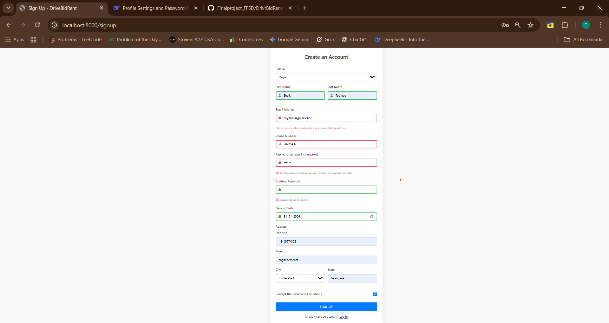 |
| **Valid** | `First Name: Shub`, `Last Name: Tushers`, `Email: Buyer999@gmail.com`, `Phone: 9874062353`, `Password: StrongPass@123` | Buyer account created successfully. | Account creation successful with proper validation. | Passed | 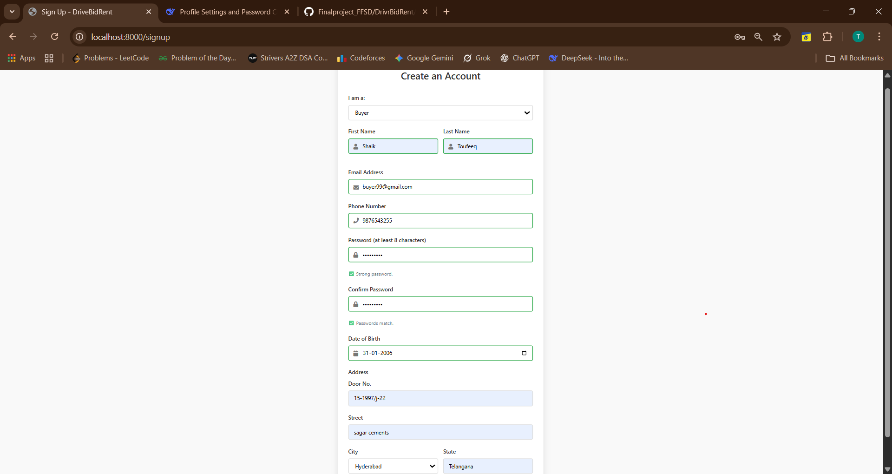 |

---

## 2. Sign In Test Cases

### 2.1 General User Sign In

| Case | Input | Expected Result | Actual Result | Status | Screenshot |
| :--- | :--- | :--- | :--- | :--- | :--- |
| **Invalid** | `Email: seller2@gmail.com`, `Password: wrongpassword` | Error message: "Login failed. Please check your credentials". | Red error banner displayed. | Passed |  |
| **Valid** | `Email: seller2@gmail.com`, `Password: correctpassword` | User successfully authenticated. | Redirects to respective user dashboard. | Passed |  |

### 2.2 Admin Sign In

| Case | Input | Expected Result | Actual Result | Status | Screenshot |
| :--- | :--- | :--- | :--- | :--- | :--- |
| **Invalid** | `Email: admin@gmail.co`, `Password: wrongpassword` | Error message: "Login failed. Please check your credentials". | Red error banner displayed. | Passed | 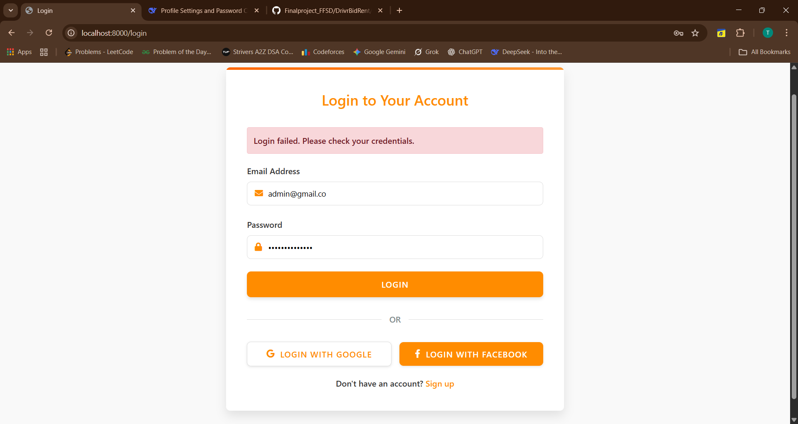 |
| **Valid** | `Email: admin@gmail.com`, `Password: correctpassword` | Admin successfully authenticated. | Redirects to admin dashboard. | Passed |  |

### 2.3 Auction Manager Sign In

| Case | Input | Expected Result | Actual Result | Status | Screenshot |
| :--- | :--- | :--- | :--- | :--- | :--- |
| **Invalid** | `Email: auction_manager@gmail.com`, `Password: wrongpassword` | Error message: "Login failed. Please check your credentials". | Red error banner displayed. | Passed | 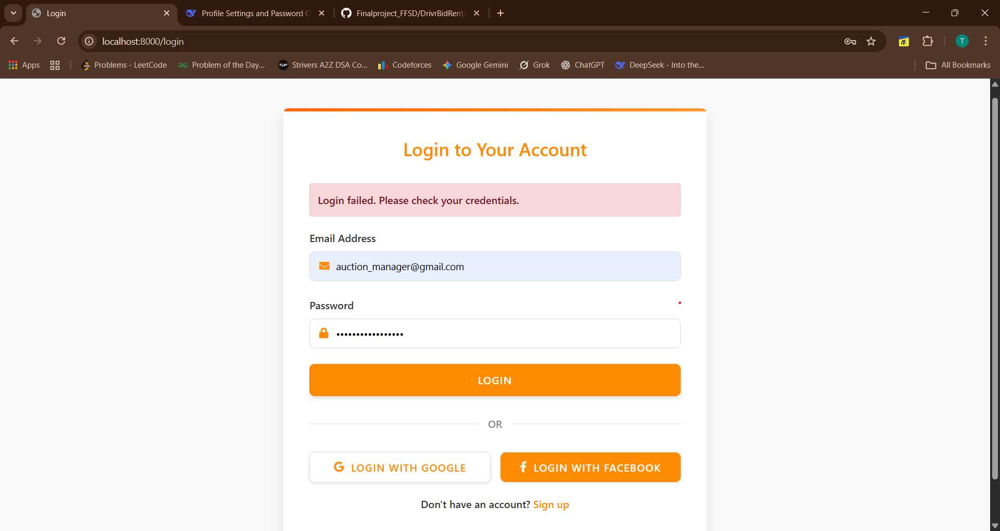 |
| **Valid** | `Email: auction_manager@gmail.com`, `Password: correctpassword` | Auction manager successfully authenticated. | Redirects to auction manager dashboard. | Passed | 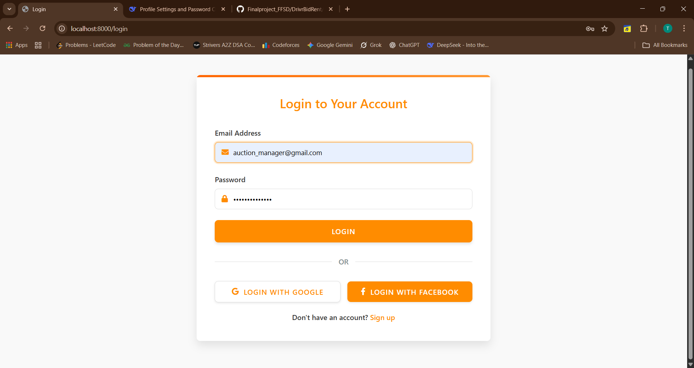 |

---

### 3.1 Add Vehicle for Auction

| Case | Input | Expected Result | Actual Result | Status | Screenshot |
| :--- | :--- | :--- | :--- | :--- | :--- |
| **Invalid** | `Vehicle Name: Hector Sharp`, `Image: No file`, `Year: 1900`, `Mileage: 0`, `Fuel Type: Not selected`, `Transmission: Not selected`, `Condition: Not selected`, `Starting Bid: empty` | Multiple error messages for all required fields and validations. | All validation errors displayed. | Passed | 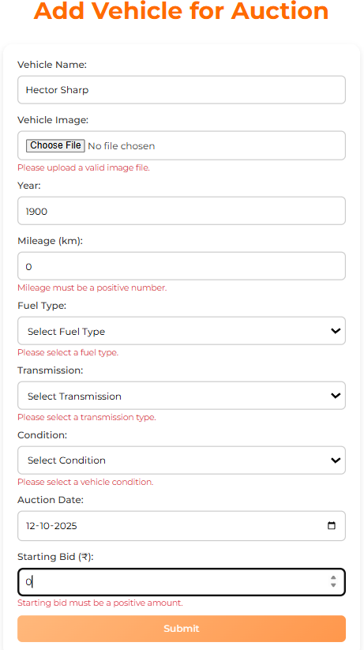 |
| **Valid** | `Vehicle Name: Hector Sharp`, `Image: hector sharp.webp`, `Year: 2022`, `Mileage: 16`, `Fuel Type: Diesel`, `Transmission: Automatic`, `Condition: Excellent`, `Starting Bid: 9000000` | Vehicle successfully added to auction. | Form submits without errors. | Passed | 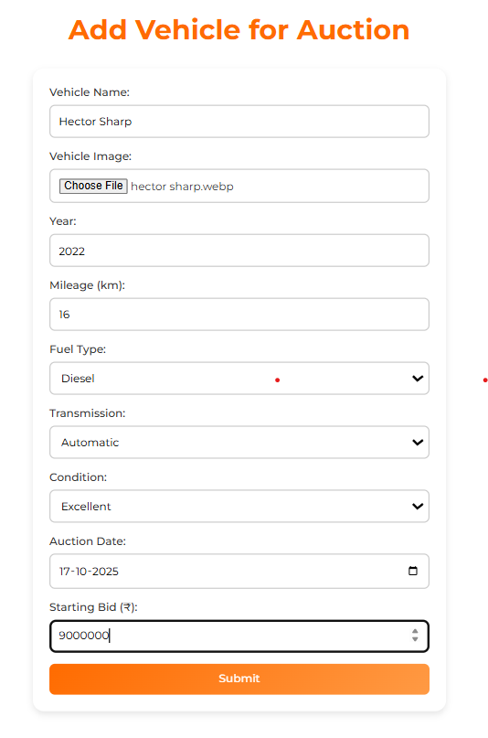 |

---

### 4.1 Add Vehicle for Rent

| Case | Input | Expected Result | Actual Result | Status | Screenshot |
| :--- | :--- | :--- | :--- | :--- | :--- |
| **Invalid** | `Vehicle Name: Tata Tiago`, `Image: No file`, `Year: 1800`, `AC: Not selected`, `Capacity: 0`, `Condition: Not selected`, `Fuel Type: Not selected`, `Transmission: Not selected`, `Cost: 0`, `Driver: Not selected` | Multiple error messages for all validation failures. | All field validation errors displayed. | Passed | 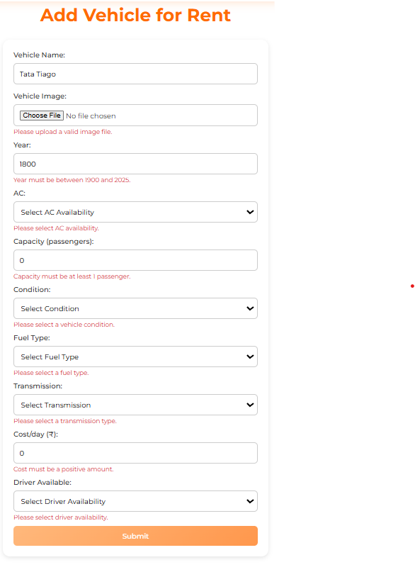 |
| **Valid** | `Vehicle Name: Tata Tiago`, `Image: add_auction_v.png`, `Year: 2023`, `AC: Available`, `Capacity: 4`, `Condition: Excellent`, `Fuel Type: Diesel`, `Transmission: Automatic`, `Cost: 1500`, `Driver: Yes`, `Driver Rate: 400` | Vehicle successfully added for rental. | Form submits successfully with all valid data. | Passed | 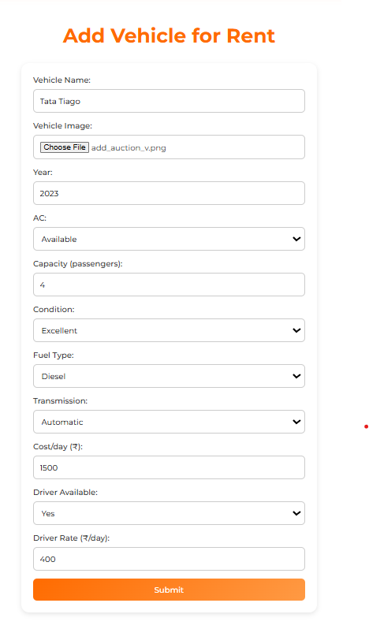 |

---

## 5. Profile Management Test Cases

### 5.1 Auction Manager Profile Update

| Case | Input | Expected Result | Actual Result | Status | Screenshot |
| :--- | :--- | :--- | :--- | :--- | :--- |
| **Invalid** | `Current Password: wrong`, `New Password: weakpass`, `Confirm Password: mismatch` | Error messages for weak password and password mismatch. | Password strength indicator shows "Weak password" and confirmation error. | Passed | 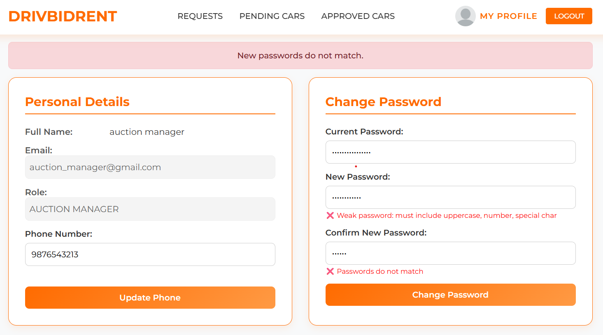 |
| **Valid** | `Current Password: correct`, `New Password: StrongPass@123`, `Confirm Password: StrongPass@123` | Password updated successfully. | "Strong password" indicator and "Passwords match" confirmation shown. | Passed | 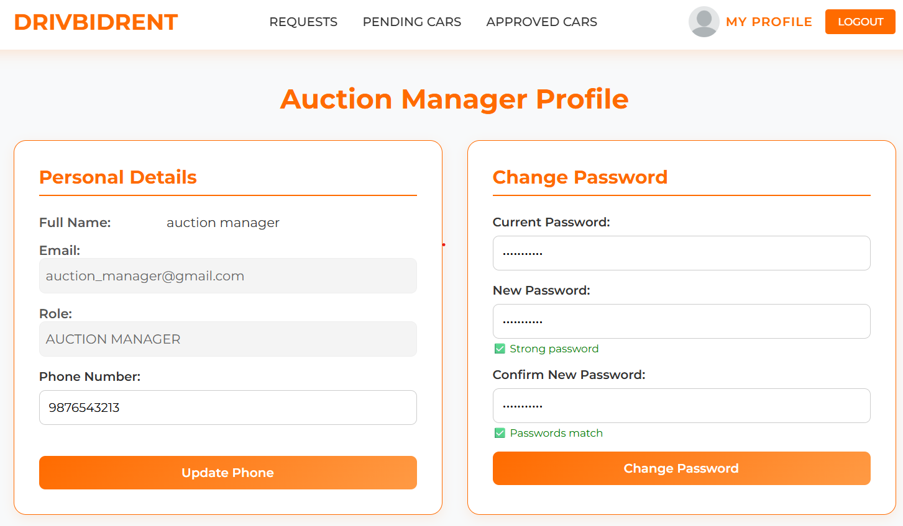 |

---

## 6. Test Case Summary

### 6.1 Overall Status
- **Total Test Cases**: 12
- **Passed**: 12
- **Failed**: 0
- **Pending**: 0
- **Success Rate**: 100%

### 6.2 Functional Areas Covered
1. **User Authentication** (Sign Up & Sign In)
2. **Auction Management** (Add Vehicles)
3. **Rental Management** (Add Rental Vehicles)
4. **Profile Management** (Update Profile & Password)

### 6.3 User Roles Tested
- ✅ General Users (Buyer/Seller)
- ✅ Admin
- ✅ Auction Manager
- ✅ Buyer (Specific)
- ✅ Seller (Specific)

---

## 7. Test Environment Details

- **Application**: DriveBidRent
- **Test Environment**: Localhost (Port 8000)
- **Browser**: Chrome/Edge
- **Test Data**: Pre-configured test accounts
- **Screenshot Directory**: `test_plan/`

## 8. Notes & Observations

1. All form validations are working correctly
2. Error messages are clear and user-friendly
3. Success scenarios redirect appropriately
4. Password strength indicators are functional
5. File upload validation is implemented
6. Role-based access is properly enforced

---
*Last Updated: October 12, 2025*  
*Test Plan Version: 2.0*

# DriveBidRent - Auction Test Cases

## Auction Bidding Test Cases

### Test Case: Invalid Bid Amount
| Case | Input | Expected Result | Actual Result | Status | Screenshot |
| :--- | :--- | :--- | :--- | :--- | :--- |
| **Invalid Bid** | `Bid Amount: ₹9,020` | Error message: "Your bid must be at least ₹902,000" | Validation prevents bid submission with insufficient amount | Passed |  |

### Test Case: Valid Bid Placement
| Case | Input | Expected Result | Actual Result | Status | Screenshot |
| :--- | :--- | :--- | :--- | :--- | :--- |
| **Valid Bid** | `Bid Amount: ₹902,000` | Bid placed successfully with confirmation message | "Your bid has been placed successfully!" message displayed | Passed |  |

### Test Case: Successful Bid Confirmation
| Case | Input | Expected Result | Actual Result | Status | Screenshot |
| :--- | :--- | :--- | :--- | :--- | :--- |
| **Bid Confirmation** | N/A (Post-bid view) | Display updated current bid and success message | Current bid updated to ₹902,000 with success confirmation | Passed |  |

## Auction Flow Summary

### Pre-Bid State
- **Starting Bid**: ₹7,00,000
- **Current Bid**: ₹9,00,000
- **Minimum Bid**: ₹902,000
- **Auction Date**: Sunday, 12 October 2025

### Post-Bid State
- **Current Bid**: ₹902,000
- **Status**: Bid successfully placed
- **User**: BUYER 3

## Test Results
- **Total Auction Test Cases**: 3
- **Passed**: 3
- **Failed**: 0
- **Success Rate**: 100%

## Observations
1. Bid validation correctly prevents bids below minimum threshold
2. Successful bids update the current bid amount immediately
3. Clear user feedback provided for both success and error states
4. UI consistently displays auction information across all states